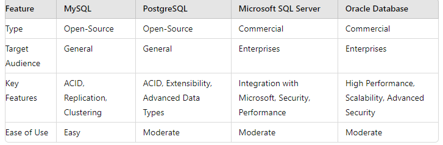

* Upload the table in a document or as a picture onto this repo. 
## Endpoints
### User Authentication
- `POST /auth/register`: Register a new user
- `POST /auth/login`: Login a user

### Expense Management
- `POST /expense/add`: Add a new expense
- `GET /expense/:user_id`: View expenses for a user

## Dependencies
- express
- mysql2
- body-parser
- bcryptjs
- dotenv

